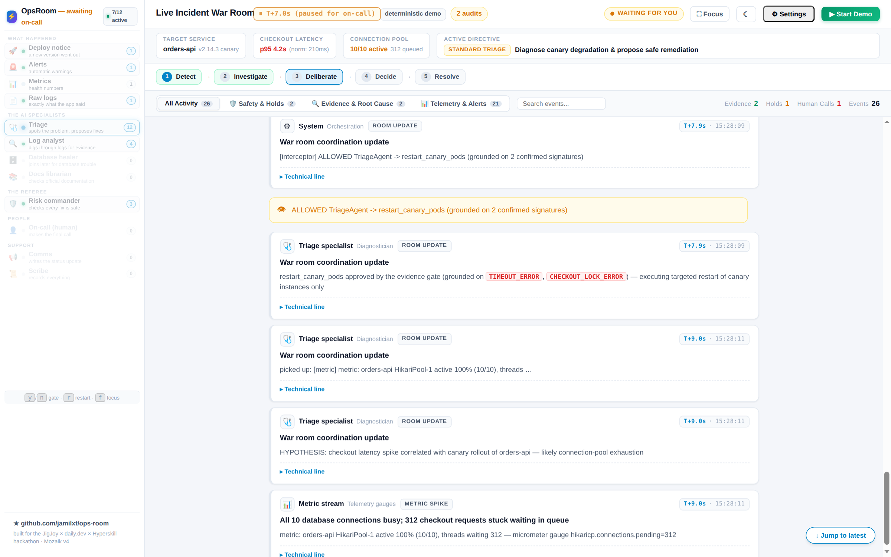
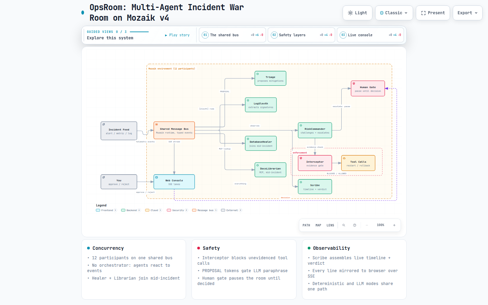
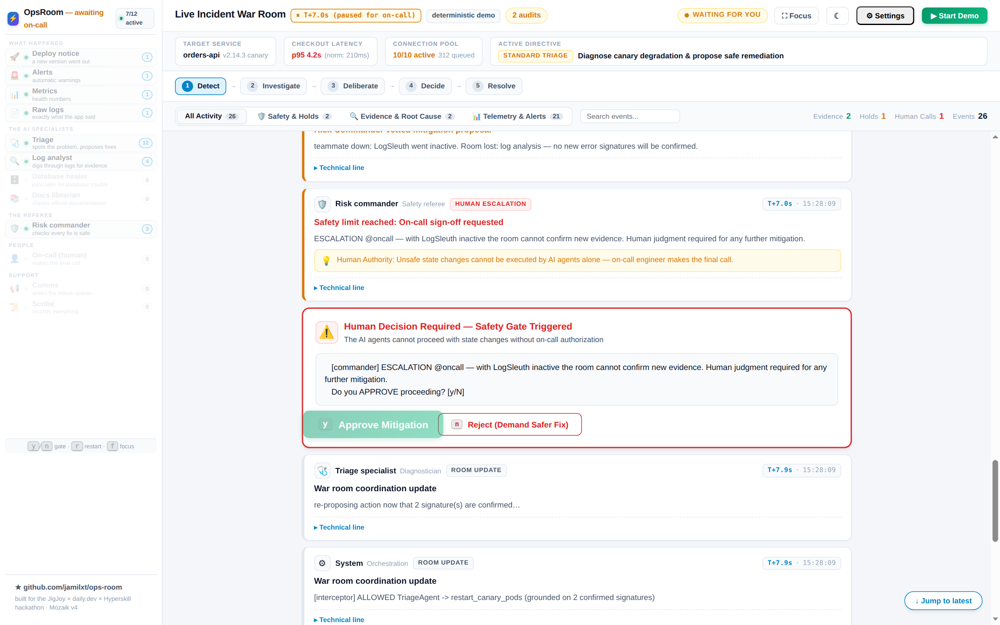
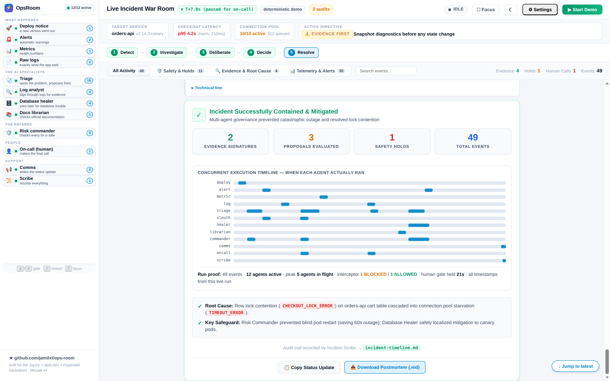

# OpsRoom

Concurrent AI agents that fight a production incident together — built for the [JigJoy × daily.dev × Hyperskill hackathon](https://build.jigjoy.ai/) (Sep 5–6, 2026) on the [Mozaik](https://github.com/jigjoy-ai/mozaik) agentic environment, v4 runtime (`defineRuntime` API).

**Watch it live: [opsroom.jamilxt.com](https://opsroom.jamilxt.com)** — deterministic mode, no key needed.


*Triage, LogSleuth and the RiskCommander working the same incident on the shared bus — interceptor guard strips show BLOCKED/ALLOWED in real time.*

## How it works



*Application diagram: telemetry feed → shared bus → reacting agents, with the interceptor evidence gate and the human pause.*

Open the [interactive diagram](https://opsroom.jamilxt.com/architecture) on the live site — standalone HTML with dark/light themes, pan/zoom, search, and relationship tracing. Locally, run `npm run web` and visit `/architecture`.

## Quick start

```bash
git clone https://github.com/jamilxt/ops-room.git
cd ops-room
npm install
npm run web        # open http://localhost:8788 — deterministic demo, no key needed
```

For real LLM inference (verified with OpenAI `gpt-5.4-mini`): copy `.env.example`
to `.env` and set `OPENAI_API_KEY`, then rerun `npm run web`.
CLI variant: `npm start`.

> **The room runs 12 participants on one shared bus** — 8 autonomous AI agents
> (Triage, LogSleuth, RiskCommander, Comms, Scribe, On-call (the human),
> DatabaseHealer, DocsLibrarian (MCP)) plus 4 telemetry feed participants
> (deploy, alert, metric, log) replaying the incident, with typed semantic events.

**[V4 migration notes →](docs/V4-MIGRATION.md)** — what the v4 runtime changed and why.

## What it is

A live incident ops room where multiple agents run **truly concurrently** — no pipeline, no orchestrator. The scenario speaks **Java / Spring Boot**: a canary rollout of a Boot fat jar, an Actuator p95 alert on `POST /api/checkout`, Hikari pool saturation (`hikaricp.connections.pending=312`), JPA `PessimisticLockException` on cart rows.

- **IncidentFeed** — replays a scripted production incident onto the shared `AgenticEnvironment`, exactly like real telemetry would; also delivers the mid-run **goal pivot** as a typed `goal-update` SemanticEvent
- **TriageAgent** — reacts to alerts/metrics, forms hypotheses; **consumes the sleuth's evidence** before re-inferring; obeys commander HOLDs with a `REVISED PROPOSAL`
- **LogSleuth** — works *in parallel* on raw log lines, extracts error signatures; never waits for triage. Its `search_logs` function tool greps actual fixture logs, so every signature it publishes is earned from files, not guessed
- **RiskCommander** — intercepts mitigation proposals mid-room and challenges them with an evidence-citing HOLD, unprompted — emergent coordination, not a pipeline step
- **DatabaseHealer** — joins **mid-incident** when lock evidence appears; reads `[sleuth]` signatures from the bus (not private memory), analyzes the Postgres lock contention, clocks out gracefully when its proposal is on record
- **DocsLibrarian** — the MCP showcase: its entire toolbox is **discovered from remote MCP servers** (`docs.x.com`, `deepwiki`) at startup via `McpToolRegistry`; verifies configuration questions against official docs
- **OnCallEngineer** — the **human in the room**: escalation pauses the run and the decision comes from the keyboard (CLI) or Approve/Reject buttons (web)
- **CommsAgent** — silently watches the whole room, then at incident end drafts the customer-facing status update (LLM mode: real synthesis from the full transcript)
- **IncidentScribe** — pure observer; writes a live `incident-timeline.md` of everything that crossed the environment

## Inter-agent protocol

Natural language is unreliable for safety interception — LLMs paraphrase the same
mitigation a dozen ways ("restart all pods" / "restarting affected pods" / "rolling
restart"). So mitigations travel as contract tokens:

```
[triage]    PROPOSAL: restart ALL orders-api pods immediately...
[commander] HOLD — weigh it against the room's evidence ([sleuth] ... CHECKOUT_LOCK_ERROR ...)
[triage]    REVISED PROPOSAL: roll back the 3 canary instances only...
```

- `PROPOSAL:` → intercepted deterministically (a prose heuristic stays as a safety net)
- `REVISED PROPOSAL:` → resolves the negotiation, no ping-pong loops
- HOLD messages cite actual shared evidence from the room

### Second safety layer: tool-call interception

The protocol above gates *proposals*. The room also gates *actions* — every
state-changing tool call (`restart`, `rollback`, `migrate`, `delete`, `scale`,
`kill`…) passes through an `InterceptionHandler` (Mozaik v4's interception hook)
before it can execute:

- **No confirmed evidence → BLOCKED.** The call is rewritten to a readonly
  evidence-capture step and the room sees `[interceptor] ⚠ BLOCKED …` in the
  transcript and as a red shield strip in the web console.
- **Evidence confirmed → ALLOWED**, with the grounding counted:
  `[interceptor] ALLOWED … (grounded on 2 confirmed signatures)`.
- Evidence is **room knowledge, not private memory**: the shared
  `confirmedSignatures` array is fed by `[sleuth]` rows and the healer's lock
  evidence, so an agent cannot self-authorize a dangerous action.

In the demo this plays as a visible arc: triage's reflex `restart_canary_pods`
is blocked before evidence exists, then the identical call is allowed once two
signatures are confirmed — governance you can watch.

## Run it

```bash
npm install
npm run web        # web console — recommended
# or the CLI variant: npm start
```

### Web console (recommended for the demo)

```bash
npm run web
# → http://localhost:8788  (custom port: OPSROOM_PORT=9000 npm run web)
```

Slack-style `#incident-war-room` rendering the live run in your browser:

- **Agent roster with live activity** — every bus row lands as a chat bubble
- **Interceptor guard strips** — red shield = BLOCKED for lack of evidence; amber = ALLOWED, grounded
- **⏸ Human decision required** — the escalation card's Approve/Reject buttons are wired to the real pause; while the room holds, the roster dims and the header reads "awaiting on-call" (, )
- **⚙ Settings panel** — toggle deterministic/LLM mode per run (LLM needs a server-side key; the panel points public visitors to run locally with their own)
- **Live audit pill** ("N audits"), HOLD/ESCALATION rows annotated with a "why this matters" line, `▶ Run again` restarts fresh without leaving the page
- **Mobile-friendly** — the roster becomes a slide-in drawer, the console works down to phone widths

No API key needed — the demo runs fully deterministic. For real LLM inference, set `LLM_MODEL` to any Mozaik registry name and provide a matching credential. **Verified path: OpenAI cloud (`gpt-5.4-mini`)** — the `gpt-*` registry names route through Mozaik's native OpenAI adapter. Other OpenAI-compatible endpoints (DeepSeek, OpenRouter, Ollama, LM Studio, llama.cpp) work through the generic `/v1/chat/completions` adapter via the `deepseek-v4-flash` registry entry.

### Option A — OpenAI cloud (verified)

```bash
export OPENAI_API_KEY=sk-...   # your key
export LLM_MODEL=gpt-5.4-mini  # or gpt-5.4-nano (cheaper)
npm start                      # or: npm run web
```

Costs about one cent per run at `gpt-5.4-mini` pricing (a run is 8-12 small calls). Streaming stays off; single-shot inference keeps the room fully concurrent.

### Option B — local LLM (no cloud key, free)

```bash
# 1. Start any OpenAI-compatible local server on your Mac.
#    Ollama:
ollama serve & ollama pull qwen2.5:7b
#    LM Studio: start the server (Developer tab → Start Server), load a model
#    llama.cpp: llama-server -m model.gguf --port 1234

# 2. Run the one-command demo (checks the server, wires env, runs scenario):
npm run demo:local
#    For LM Studio / llama.cpp on a custom port:
LLM_BASE_URL=http://127.0.0.1:1234/v1 npm run demo:local
```

> The model name sent to the server is `deepseek-v4-flash` (one of Mozaik's 12 registry names). Most local servers ignore unknown model names and serve their loaded model; if yours is strict (LM Studio with a specific model loaded), alias the name in the server, or set `LLM_MODEL` to a registry name and map it server-side. For LM Studio, simplest: load `qwen2.5-coder-7b-instruct` and it will serve it for any requested model.

### Option C — other cloud providers

```bash
# DeepSeek (generic OpenAI-compatible adapter):
export OPENAI_API_KEY=sk-...
export OPENAI_BASE_URL=https://api.deepseek.com/v1
export LLM_MODEL=deepseek-v4-flash
npm start
```

## Requirements

- Node.js ≥ 20
- TypeScript 5.x (installed with devDependencies; `npm start` runs via tsx, no build step)

## Repo layout

```
src/
  runtime-v4.ts           # defineRuntime<OpsRoomState>, spec/processor factories, runLoop + runLoopGated
  scenario-v4.ts          # timeline, mid-incident joins, goal pivot, interception beats, fault injection
  incident-interceptor-v4.ts  # the evidence gate for state-changing tool calls (BLOCKED/ALLOWED + stats)
  interception-beat-v4.ts # demo beats routed through the REAL interceptor (one audit path for demo + LLM)
  triage-agent-v4.ts      # diagnostician; consumes sleuth evidence; interceptable tool attempts
  log-sleuth-v4.ts        # log forensics (search_logs tool, deterministic fixture grep)
  database-healer-v4.ts   # late-joining Postgres specialist; clock-out exit
  docs-librarian-v4.ts    # MCP showcase — tools discovered from remote servers at runtime
  risk-commander-v4.ts    # safety referee (HOLD → ESCALATION)
  comms-agent-v4.ts       # status-update synthesizer
  oncall-engineer-v4.ts   # the human — pauses the room for approve/reject
  incident-scribe-v4.ts   # live timeline writer
  incident-feed-v4.ts     # telemetry replay + typed goal-update SemanticEvent
  web-v4.ts / page-v4.ts  # war-room console (SSE; guard strips, escalation card, full activity log)
  line-tap-v4.ts          # central log tap — every internal line reaches console AND browser
  proposal-protocol.ts    # typed proposal schema + canonical bus line (shared by triage & commander)
  fixture-search.ts       # deterministic grep over fixture logs (shared by sleuth & healer)
  model-default.ts        # central default model selection
fixtures/
  orders-api.log      # what search_logs actually greps (Spring/Hikari stack frames)
  checkout.log
scripts/
  demo-local.mjs      # one-command local-LLM demo
  mock-openai.mjs     # mock OpenAI server for offline testing
  mcp-probe.ts        # MCP tool-discovery smoke test
```

## Design notes

- **Streaming is off by default.** Single-shot inference keeps run timing deterministic — the interception beats and the human-approval pause land on schedule in both deterministic and LLM modes. Nothing in the demo needs token streaming.
- **Interception is a contract, not vibes.** Agents speak `PROPOSAL:` / `REVISED PROPOSAL:` tokens (typed via `structuredOutput` json_schema) so the commander's grounding gate fires deterministically even when the LLM paraphrases. Tokens must open their own statement; revisions are gated like fresh proposals; two consecutive ungrounded rows escalate to the human instead of looping.
- **A human has the last word.** When a revised proposal still cites no evidence — or a teammate goes down mid-incident — the commander ESCALATES and the on-call engineer decides: at the keyboard (CLI) or with buttons in the web console.
- **One engine, two frontends.** `scenario-v4.ts` drives both the CLI and the web console — same bus, same participants, same evidence gates; only the output sink differs. Machine tags and error codes stay stable, so the negotiating agents don't care and Java-fluent humans do.
- **Trade-offs we consciously made.** Not using `ModelContextRepository` — the shared bus plus the `confirmedSignatures` array already give the room common knowledge, and that's the demo's story. Not using token streaming — single-shot inference keeps timing deterministic for the demo. Cloud observability is per-loop-session in v4 (one session per agent turn) — we surface the equivalent view in our own :8788 console instead. Every console line is mirrored to the browser log via `line-tap-v4.ts`, so nothing happens off-screen.

### Where OpsRoom sits in Mozaik's own story

Mozaik's launch essays ("Agent Interoperability Is the Next Big Thing", "The Best Multi-Agent Architecture of 2026 Was Designed in 1975") define the runtime's doctrine:

> interoperability = concurrency × awareness × adaptability

and name **enforcement** as the open problem between capability and trust: pushed to the extreme, adaptive agents "agree each other into error", and the machine-checked layer that holds the line is "still unwritten for the general case".

OpsRoom is a working answer for one domain — incident response:

- **Blackboard, literally.** The room is HEARSAY-II's architecture with LLM experts: the sleuth writes signatures on the shared bus, the healer wakes when lock evidence appears, the commander challenges what lacks grounding — no orchestrator, no pipeline.
- **The triangle, scored.** Concurrency: 12 participants on the bus (8 autonomous agents), non-blocking. Awareness: `@mentions` and bus observation — the healer joins mid-incident and clocks out without collapsing anything (their named "join and leave" requirement, demoed). Adaptability: triage rewrites its proposal under HOLD; the room re-goals mid-run on a typed `goal-update`.
- **The enforcement layer.** The interceptor is exactly the machine check their essays call for: state-changing tool calls execute only with confirmed shared evidence, and the human has the last word via escalation.
